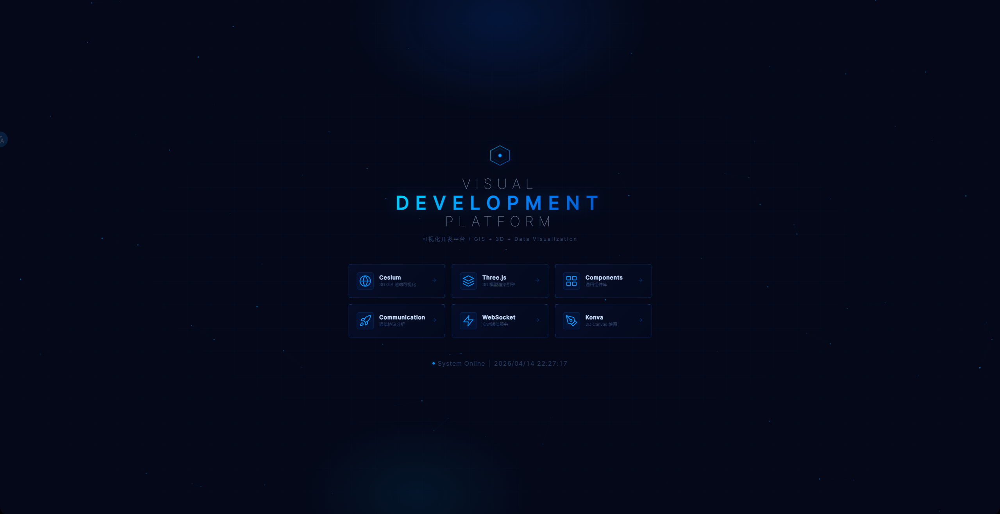
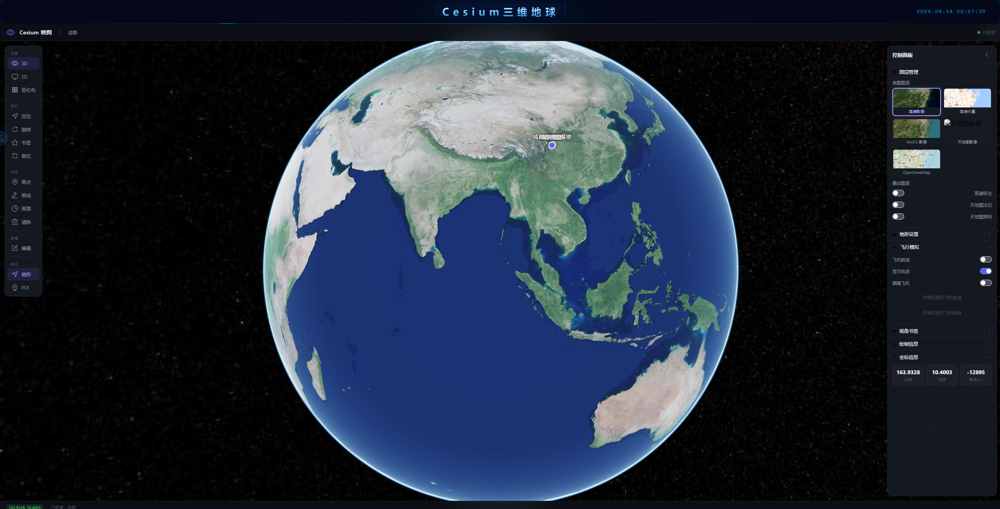
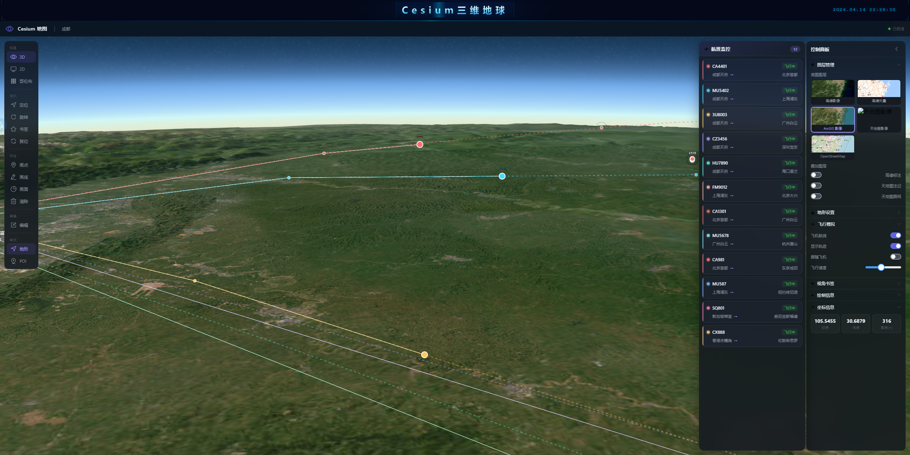
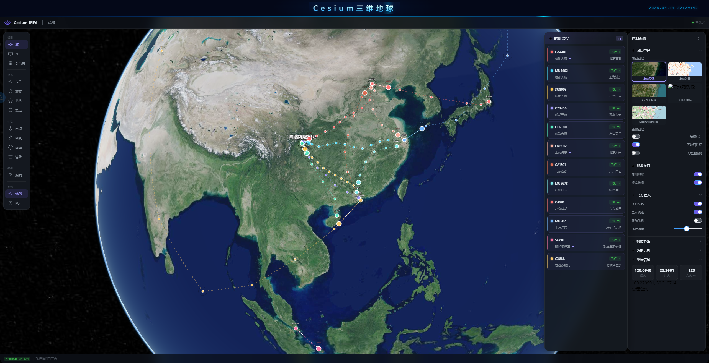
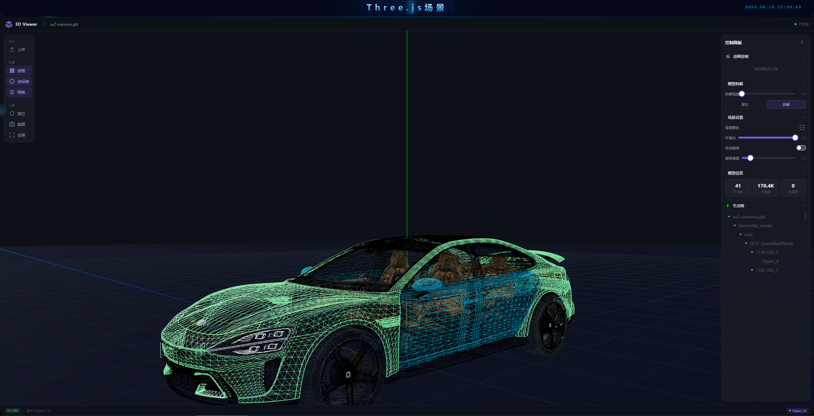
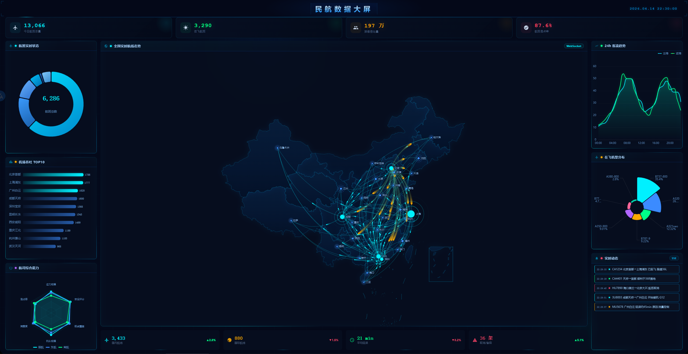

# 可视化演示项目

基于 **Vue 3 + TypeScript + Vite** 构建的前端可视化学习项目，集成了多种主流可视化技术栈，涵盖 3D 地球、3D 场景、数据图表、实时通信等方向。

## 技术栈

- **框架**：Vue 3 + TypeScript + Pinia + Vue Router
- **构建**：Vite + SCSS
- **可视化**：Cesium（3D 地球）、Three.js（3D 场景）、ECharts（数据图表）
- **UI**：Element Plus
- **通信**：WebSocket / SSE 实时数据推送

## 页面预览

### 主页

![主页]

### Cesium — 3D 地球可视化





### Three.js — 3D 场景渲染



### ECharts — 数据图表面板



### WebSocket — 实时数据大屏

基于 WebSocket/SSE 实时数据推送的航空态势监控大屏，包含航班统计环形图、航线柱状图、城市排名、实时动态列表等模块。

## 快速开始

```bash
# 安装依赖
npm install

# 启动开发服务器
npm run dev

# 构建生产版本
npm run build
```

> 需要 Node.js >= 20.19.0
